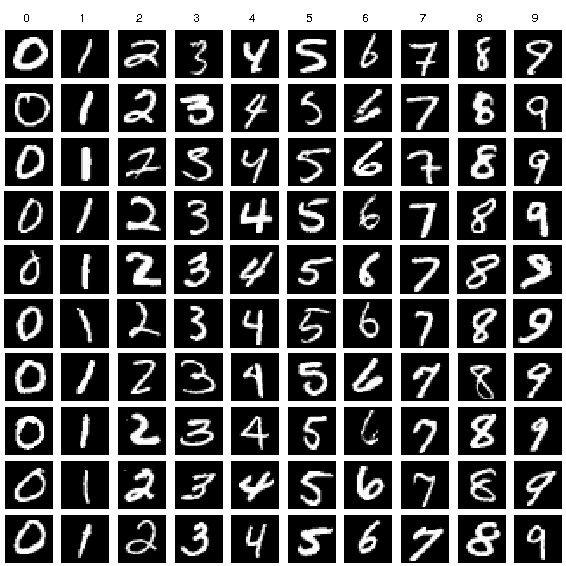

## VGG Implementation
The repository includes the implementation of VGG11, VGG13, VGG16 and VGG19 in Tensorflow 2  

### VGG Architecrures

<center>image is taken from [source](http://blog.17study.com.cn/2018/01/15/tensorFlow-series-8/)  
</center>

   
<center>VGG16 Architecture <small>source</small>.</center>

### Training on MNIST


### Requirement
```
python==3.7.0
numpy==1.18.1
```
### How to use
Training & Prediction can be run as follows:    
`python train.py train`  
`python train.py predict img.png`  


### More information
* Please refer to the original paper of VGG [here](https://arxiv.org/pdf/1409.1556.pdf) for more information.

### Implementation Notes
* **Note 1**:   
Since VGG is somehow huge and painfully slow in training ,I decided to make number of filters variable. If you want to run it in your PC, you can reduce the number of filters into 32,16,8,4 or 2. (64 is by default). For example:  
`model = vgg.VGG16((112, 112, 3), classes = 10, filters = 4)`

* Note2:   
You can also make the size of images smaller, so that it can be ran faster and doesn't take too much memories.

* Note3:   
Learning rate = 0.0001  
Batch size    = 32  
Optimizer     = Adam
Fliters       = 8
